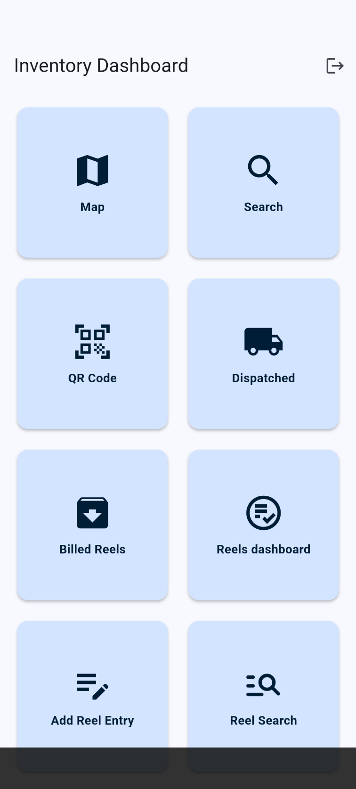
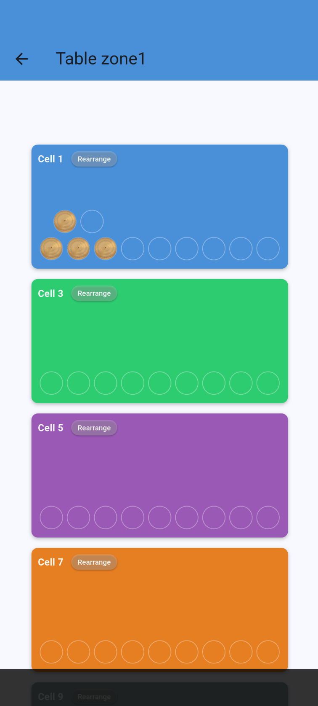
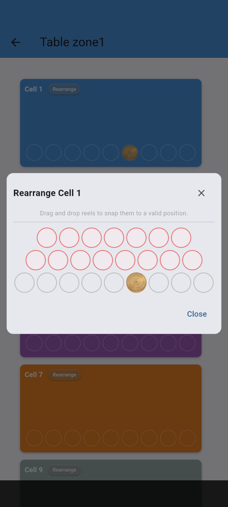
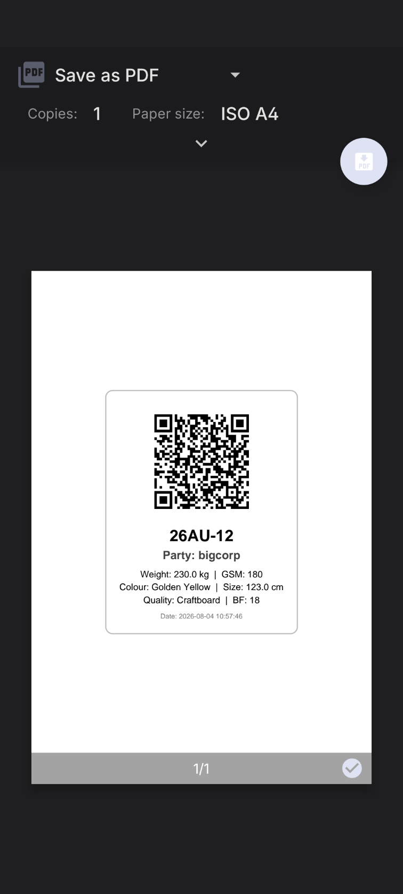
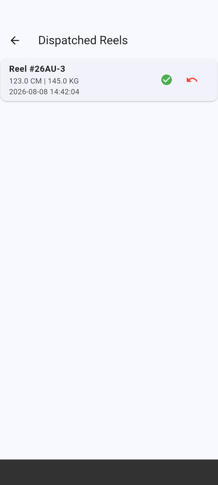
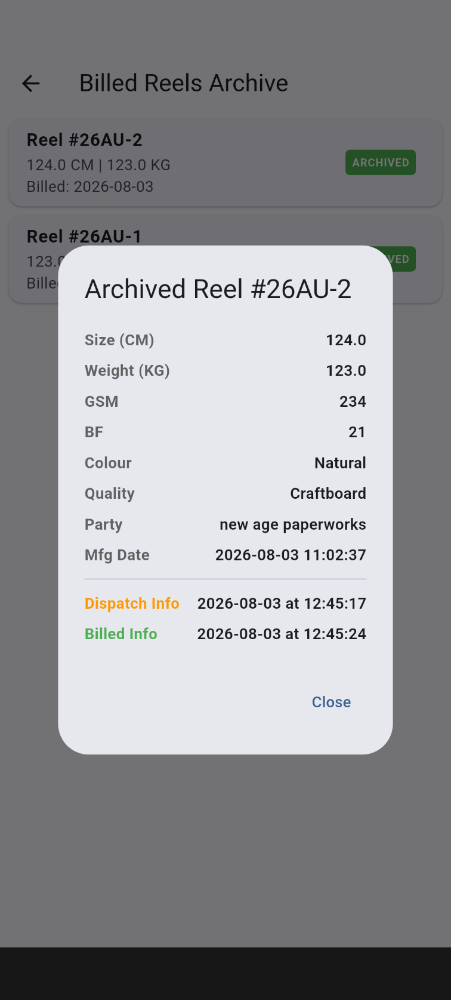
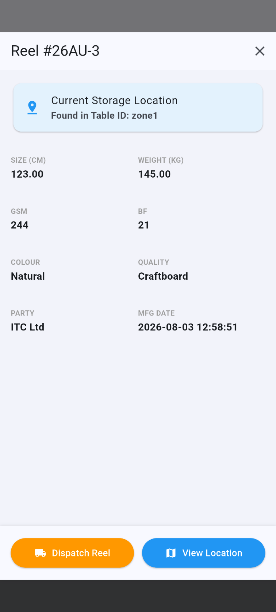
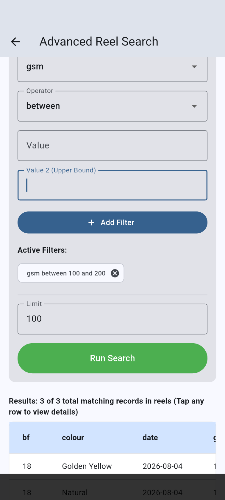

# inventory app

A flutter based client for my app
[server](https://github.com/AnubhavSingh0708/Inventory)

# features
## SSE event based
refreshes every time any change is made for high concurrency, by subscribing to server side events

## Design
Views in this app are interactive ,zoomable, refreshing colours
## Speed
Dart is known to be snappy and performant

## Screenshorts
 ### Dashboard

### Inventory table

### rearrangement GUI

### label printing

### dispatched

### Billed archive

### Scan QR code to view details

### Advanced search

